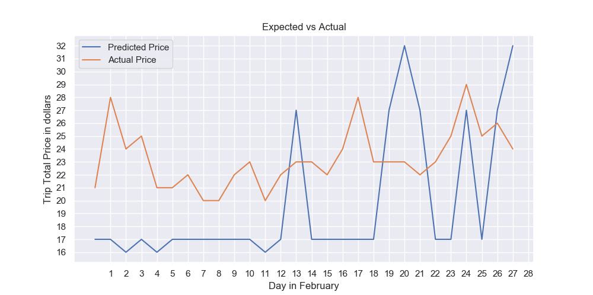
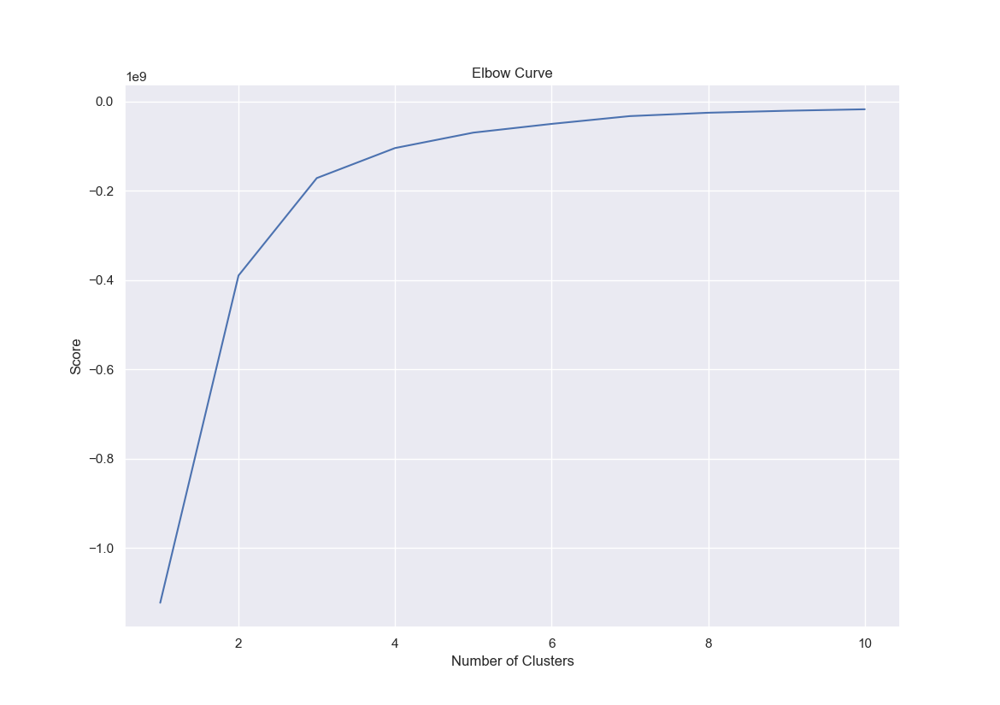
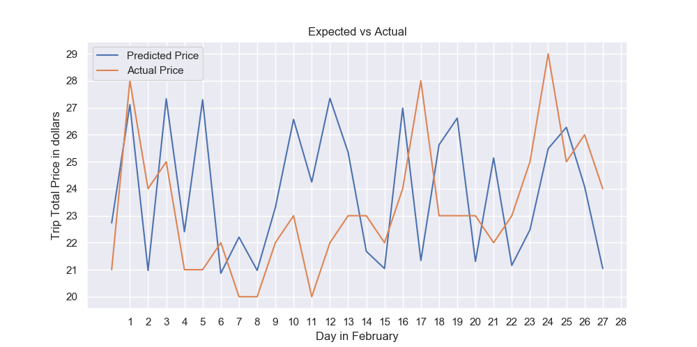

# ubercool

## Motivation 
Ride-hailing services have gained popularity in recent years due to attributes such as reduced travel costs, traffic congestion, and emissions. With the rise of Uber, Lyft, and other ride-hailing services, the demand for ride-sharing services has also increased. Moreover, Covid-19 has brought a surge in ride-sharing demand. Our goal is to first find the correlation between the demand for ride-sharing services and the spread of Covid-19. Then we will build a model that predicts the price of a ride-sharing service based on the demand for ride-sharing services.
## Task
- The __prediction task__ we have is __a multi-class classification task__ where the target attribute is the __ride-sharing price__ (the column `trip_total`) of a certain day in February of 2022. Using the Chicago Transport dataset, we prepare our models by feeding in the dataset from 2020 to 2022 January. We then use the models to predict the prices for the days in February of 2022 and compare the predictions with actual prices, which we know. The metrics for success is basically how well the model predicts the prices (using `MSE` to calculate the distance). 

- The __hypothesis tests__ we have are 
  - Covid cases and Trip price are independent of each other.
  - The time series data for `trip_total` we have is non stationary, in other words, it has a unit root. 
    
  - Our time series data set has a Gauassian distribution.

## Evaluation Metrics used and Results
- We used MSE to measure the distance between the predicted price of a day an the corresponding actual price. Here is the table that summarizes the result.

| Model | MSE |
|:---:|:---:|
| `Linear Regression` | 37.6785 |
| `KMeans + SVM` | 25.4223 |
| `LSTM` | 0.1860 |

- We decided to use MSE because we want to minimize the distance between the predicted price and the actual price and we can easily do that using MSE since all points are in a simple 2d euclidean space.
- We did not encounter any challenges while evaluating the models.
- We did not need to restructure or clean our data.

## Full Results with Graphs

### __Machine Learning Component__
1. __Preprocessing the data__: All of the preprocessing could be found in `code/preprocess.py`. In terms of preprocessing the data, we first removed the `year` and `month` columns from our DataFrame since our data points were already ordered and these two values had the potential of holding high weights when our models make predictions. We also needed to convert the `trip_total` column to their appropriate labels (__label for that data point == round up value of the `trip_total` for that data point__). Before we split our dataset into training and testing, we also made sure we scale the data to have a mean of 0 and standard deviation of 1 for each column. This is done using `sklearn.MinMaxScaler()`. Once the transformations were done, we split the dataset into training and testing at the ratio of `4:1`. Our dataset did not really have any sensitive or protected attributes we have to worry about.
2. __Model Selection Process__: Since our plan was to use multiple models to predict the prices, we had to decide which models we wanted to go with. We already knew we wanted to use `Linear Regression` as our baseline model, so that left us to pick two other models. We wanted to learn the distribution of the data points in our dataset so we first used Principal Component Analysis to reduce the dimensions of the dataset. The result is given below. The first image is PCA = 2

The second image is PCA = 3

From the above two plots, we can see that there is one big cluster in the data. Looking at this, we concluded that we first needed to un-cluster this cluster and fit a model for each similar cluster to classify the data points. To un-cluster, we thought we could use KMeans unsupervised learning algorithm. Then, we decided to fit SVM for each cluster in KMeans. This way, we have higher likelihood of classifying the data point correctly. Finally, since this is a time series dataset, we thought using LSTM deep learning model will be good for our task considering how well it performs on time series data.

3. __Linear Regression__: Our first model was Linear Regression. Even before training I knew this model will perform badly because of the nature of our dataset, which we discovered using PCA. As expected, using simple Linear Regression, we got the following approximation. 

This poor result can be explained by the fact that you cannot draw lines to classify the data points as most of them are clustered in one space. This result is expected.
4. __KMeans + SVM__: Our second model was KMeans + SVM. We first did an elbow plot to find the optimal number of clusters we should have and here is the result.

From this, I could see that when `k = 3`, the elbow was seen so we decided to use this value. First, we apply KMeans on our training dataset. Then for each cluster, we created a new DataFrame with the matching data points. We then fit SVM on each of the new DataFrames. Finally, we used the predictions of the SVM models to predict the prices for the testing dataset. Here is the plotted version of the result

This model performed a lot better than our baseline model and we believe this is because we were able to un-cluster the data points and fit SVM on each similar data points, which increased the likelihood of classifying the data point correctly.
Finally, the MSE calculation is done by taking the average of __KFold cross validation__ where `K = 5`.
5. __LSTM__: Our third and final model was LSTM. We decided to use this model because our dataset was a time series dataset and we wanted to retain information from the previous data points. Our LSTM model structure is pretty simple in that we used only 1 visible layer with a hidden layer consist of 4 LSTM blocks, which keeps track of the cell state and hidden state. We use adam optimizer and MSE as our loss function. We train for 100 epochs and achieved a loss of 0.081. Below shows the predictions vs actual labels plot for this model

Finally, the MSE calculation is done by taking the average of __KFold cross validation__ where `K = 5`.
As you can tell, LSTM model performed so much better than the previous two. This is because our LSTM model 'retained' information (via hidden state and cell state) from the previous data points and was able to predict the price of the next data point from there.
6. __Conclusion__: Here is the summary plot that compares the predictions of the three models and the actual ground truth labels for the month of February, 2022.

Here we notice that LSTM performed the best, followed by KMeans + SVM and Linear Regression.

### __Stats Component__
- __Hypothesis Test 1__: 
  - Null Hypothesis: Covid cases and Trip price are independent of each other.
  - Alternative Hypothesis: Covid cases and Trip price are dependent of each other.

  - Motivation: We want to learn if there is any relationship between the two attributes (`trip_total` and `cases_total`)

  - P-Value: 0.05 (0.05 is the significance level)

  - Test Used: Chi-Square Test 
  - Reason for using this Test: We wanted to see if there was any relationship between the two attributes and Chi-Square Test is the best test as it allows us to see if there is any statistically significant difference between the expected frequencies and the observed frequencies. 

  - Result: Since p < 0.05, we reject the null hypothesis. The two attributes in question are dependent of each other.
    - Chi-Square Statistic: 10705.839180
    - p-value: 0.0001 
    - Critical Value: 10323.781777

- __Hypothesis Test 2__:
  - Null Hypothesis: The time series data for `trip_total` we have is non stationary, in other words, it has a unit root. 
    It is much affected by the Covid-19 pandemic.

  - Alternative Hypothesis: The time series data for `trip_total` we have is stationary, in other words, it does not
    have time-depenedent structure.

  - Motivation: By learning this additional information, we might be able to do feature engineering
    and feature selection to make our Machine Learning model fit better and perform well.

  - P-Value: 0.05 (0.05 is the significance level)

  - Test Used: Augmented Dickey-Fuller Test
  - Reason for using this test: Dickey-Fuller test allows to check if a unit root is present in an autoregressive time series model.

  - Result: Since p > 0.05, we fail to reject the null hypothesis. Therefore, our time series data is non-stationary.
    - ADF Statistic: -1.349072
    - p-value: 0.606434
    - Critical Values:
        - 1%  : -3.439
        - 5%  : -2.865
        - 10% : -2.569

- __Hypothesis Test 3__
  - Null Hypothesis: Our time series data set has a Gauassian distribution.

  - Alternative Hypothesis: Our time series data set has a non-Gauassian distribution.

  - Motivation: We want to learn if our time series data set has a Gaussian distribution or not because
    Machine Learning model makes the assumption that any input dataset has this property. From learning this,
    we know if we will need to preprocess the data so that they will then have Gaussian distribution.

  - P-Value: 0.05 (0.05 is the significance level)

  - Test Used: Multivariate Normality Test
  - Reason for using this test: Since our data points are high dimensional, we had to analyze the distribution of the data points using the criteria for MNV. So we used Multivariate Normality Test that checks for that requirement.

  - Result: Since p < 0.05, we reject the null hypothesis. Therefore, our time series data set is not MVN.
    -   p-value: 0.0012

